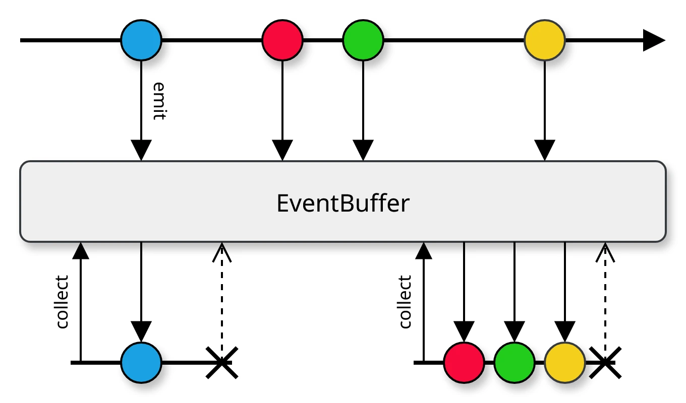
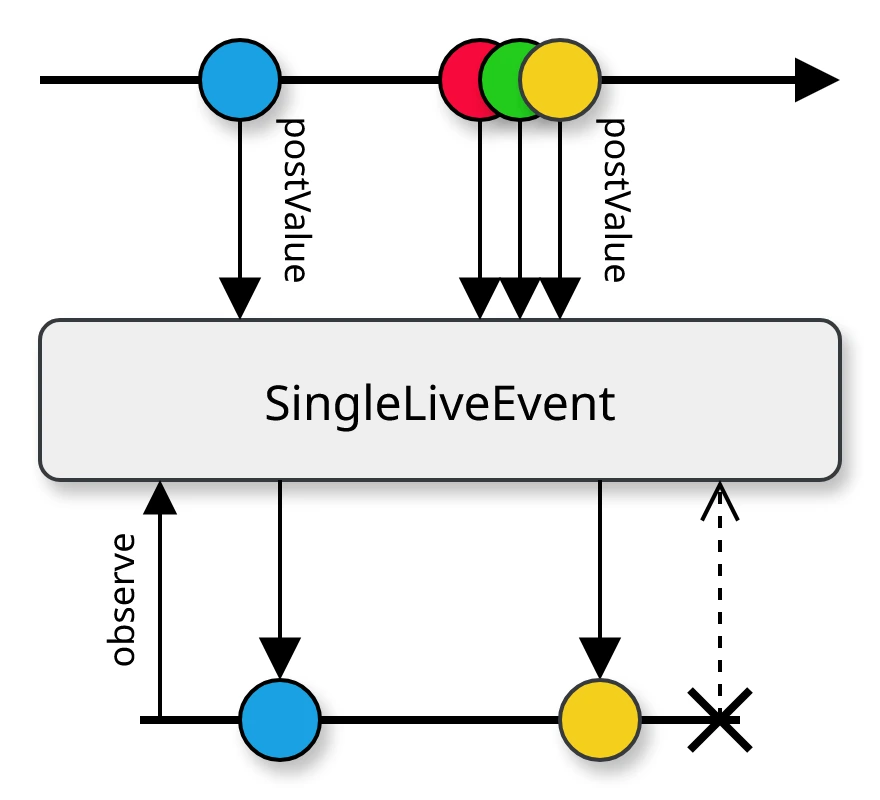
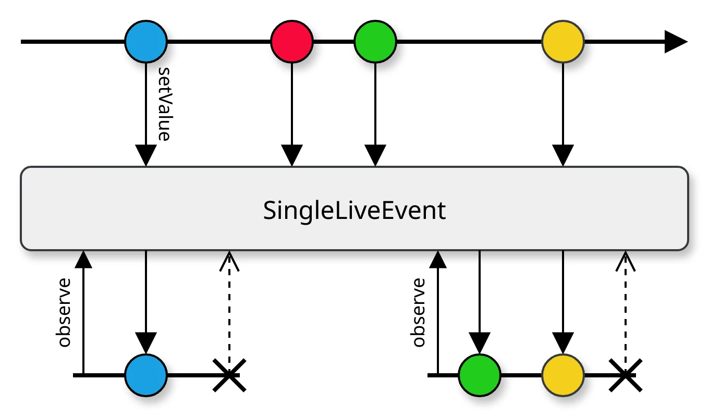
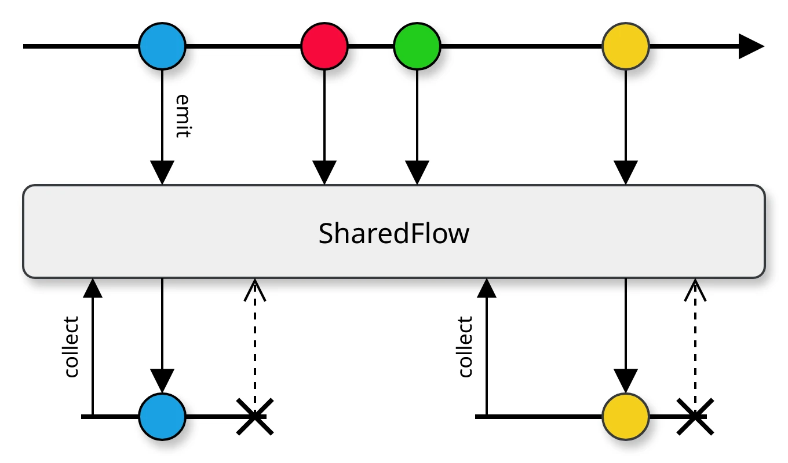

[](https://opensource.org/licenses/Apache-2.0)
[](https://circleci.com/gh/Antimonit/EventBuffer)
[](https://codecov.io/gh/Antimonit/EventBuffer)

# EventBuffer

`EventBuffer` delivers events across the View–ViewModel boundary, conceptually similar to
`SingleLiveEvent`.

Unlike `SingleLiveEvent`, it guarantees that each event is consumed **once and
only once**.



## Usage

Similar to `LiveData` and `MutableLiveData`, `EventBuffer` is read-only, and sending
events is only possible through the `MutableEventBuffer` interface.

```kt
import me.khol.arch.*

class MyViewModel : ViewModel() {

    private val _events = MutableEventBuffer<Int>()
    val events: EventBuffer<Int> = _events

    fun sendValues() {
        viewModelScope.launch {
            _events.send(0)
            delay(10)
            _events.send(1)
            _events.send(2)
            _events.send(3)
            delay(10)
            _events.send(4)
        }
    }
}
```


Note that to guarantee the delivery of events, the `send` method is suspending and
must be executed from a suspending context.

In Android components with a `Lifecycle`, use the `EventBuffer.collect` extension function to
collect events in a lifecycle-aware fashion.

```kt
import me.khol.arch.*

class MyFragment : Fragment() {

    val viewModel: MyViewModel by viewModels()

    override fun onViewCreated(view: View, savedInstanceState: Bundle?) {
        super.onViewCreated(view, savedInstanceState)
        viewModel.events.collect(viewLifecycleOwner) {
            // handle event
        }
    }
}
```

## Design

This section outlines the design decisions behind `EventBuffer`.

### Limitations of SingleLiveEvent

Although `LiveData` is reliable as a stream of **state** in the Android world, it cannot reliably
represent a stream of **events**. To provide this functionality, `SingleLiveEvent` was retrofitted
on top of `LiveData`, but this approach is inherently flawed.

In contrast to **state**, where we care only about the latest value and reading the same value
multiple times or none at all is perfectly valid, we want **events** to be consumed once and only
once. This requires ensuring that:

* **no event is dropped** (e.g., when there are no active observers or when too many events are emitted at once)
* **no event is consumed multiple times** (e.g., after reconnecting an observer)

Extending `SingleLiveEvent` from `LiveData` has one crucial consequence. Since `LiveData` is by
design conflated, `SingleLiveEvent` also inherits this behavior. As a result, `SingleLiveEvent`
cannot queue more than one event at a time and this can violate the requirement that each event is
consumed at least once in two ways:

#### Burst Event Emissions



<details>
<summary>Details</summary>

When multiple events are sent in rapid succession, the event stored in `SingleLiveEvent` may be
overwritten before the View has a chance to consume it.

This happens only with `postValue()` and can be avoided by using `setValue()` exclusively on the
Main thread.

When `postValue()` is used—regardless of the calling thread—a `Runnable` is enqueued in the Main
thread's `Looper`, making the update asynchronous. By the time the callback is processed, the value
may have been updated again, causing one or more events to be lost.

> Note: `postValue()` is problematic only in conjunction with `SingleLiveEvent`. It is safe to use
> on `LiveData`, where conflation is expected.

</details>

#### Sending Events with No Active Collector



<details>
<summary>Details</summary>

When the collector is stopped (i.e., in the `CREATED` or `DESTROYED` state), new events will
overwrite any undelivered event stored in the `SingleLiveEvent`.

This can occur when *multiple* events fire while the View is disconnected from the ViewModel, either
because of:
* a configuration change destroy–recreate cycle, or
* the View entering a stopped state because it has been temporarily replaced by another Activity
  or Fragment.

This may happen if multiple events occur at just the right moment during a configuration change.

A more common case is when a Fragment in a ViewPager scrolls off-screen and enters the `CREATED`
state.

</details>

### Limitations of SharedFlow

It is reasonable to assume that `SharedFlow` might serve as a replacement for `SingleLiveEvent`,
just as `StateFlow` can fully replace `LiveData`. However, while `SharedFlow` can buffer events sent
in rapid succession, it falls short when an event is emitted while there are no active observers.
In such cases, the event is simply dropped.



### Channel

High-level primitives like `SharedFlow` and `StateFlow` do not meet the requirements.

* `StateFlow` is conflated by design.
* `SharedFlow` drops events when no observers are active.

Using `Channel` presents these options:

1) Use non-suspending `trySend` with the `SUSPEND` overflow strategy and a large `capacity` to reduce the chance of failure. If over capacity, `trySend` returns `false` and the event is discarded.
2) Use non-suspending `trySend` with `DROP_OLDEST` or `DROP_LATEST` so trySend cannot fail; exceeding capacity overwrites an unconsumed event.
3) Use suspending `send` with `SUSPEND` overflow strategy and `launch` a coroutine manually and letting it suspend.
4) Use suspending `send` with `SUSPEND` overflow strategy and propagate the `suspend` modifier upstream.

Options 1 and 2 are effectively identical for our purposes: both lose events, differing only in 
which events are dropped. We cannot use `trySend` at all.

Option 3 is unsuitable because it breaks structured concurrency.

Option 4, which forms the basis of `EventBuffer`, pauses the sender when the buffer is full instead
of dropping events, ensuring all events are delivered while preserving structured concurrency.

#### Buffering

What is an appropriate buffer size?

A buffer size of 0 is the most consistent and predictable, but it would unnecessarily hinder
performance, as every `MutableEventBuffer.send` call would suspend until the event is fully
processed.

An unlimited buffer may lead to memory starvation if events are produced faster than they can be
consumed over an extended period.

`EventBuffer` inherits a buffer size of 64 from `Channel`. If more than 64 events accumulate,
any additional `MutableEventBuffer.send` calls will suspend. This provides a sensible balance:
in most cases, suspension is unnecessary, while the number of unprocessed events in memory never 
exceeds 64 plus the number of active coroutines. In other words, unless thousands of concurrent
coroutines send events into the same `EventBuffer`, memory issues are unlikely.

#### Note on multicasting

`SharedFlow` supports multicasting natively, but we cannot use it because it drops events when no
observers are active. `Channel`, however, does not support multicasting at all, and events are
distributed fairly in FIFO order among collecting coroutines.

Multicasting events to multiple observers is conceptually problematic, particularly when supporting
observer disconnection and reconnection, as well as buffering events when no observers are active.

Delivering buffered events to all observers would require an additional mechanism to explicitly 
start event delivery, similar to what `ConnectableObservable` in the RxJava library provides. This
would greatly complicate the design, so it was omitted.

**Multicasting events across the View–ViewModel boundary is therefore discouraged.**

Only a single subscriber may call `collect` on an `EventBuffer` at a time. Any additional call while
a previous collector is still active will throw an `IllegalStateException`.

If a single event must be delivered to multiple observers, create a separate `EventBuffer` for
each observer.

See also:
* [[Proposal] Primitive or Channel that guarantees the delivery and processing of items](https://github.com/Kotlin/kotlinx.coroutines/issues/2886)
* [Sending events to UI.kt](https://gist.github.com/gmk57/330a7d214f5d710811c6b5ce27ceedaa?permalink_comment_id=3639568#gistcomment-3639568)

## License

```text
Copyright 2024 David Khol

Licensed under the Apache License, Version 2.0 (the "License");
you may not use this file except in compliance with the License.
You may obtain a copy of the License at

    http://www.apache.org/licenses/LICENSE-2.0

Unless required by applicable law or agreed to in writing, software
distributed under the License is distributed on an "AS IS" BASIS,
WITHOUT WARRANTIES OR CONDITIONS OF ANY KIND, either express or implied.
See the License for the specific language governing permissions and
limitations under the License.
```

See [LICENSE](LICENSE) for more details.
